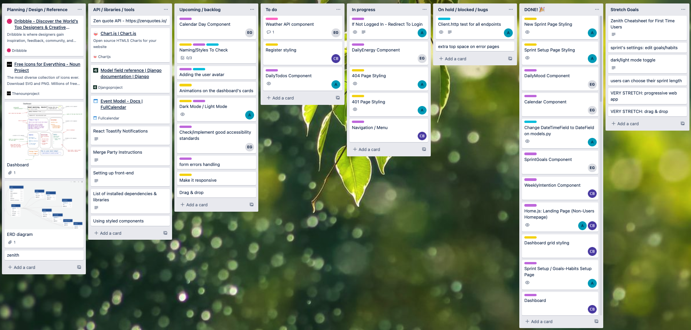
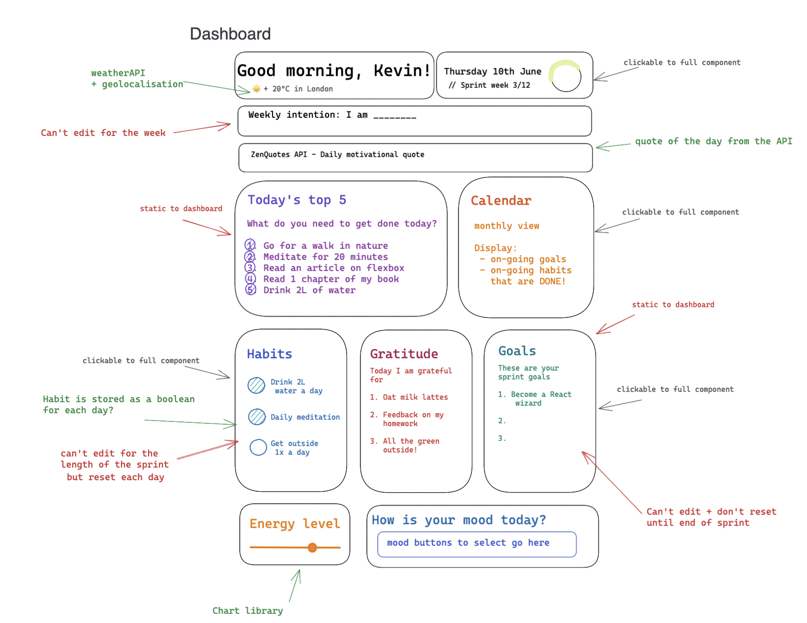
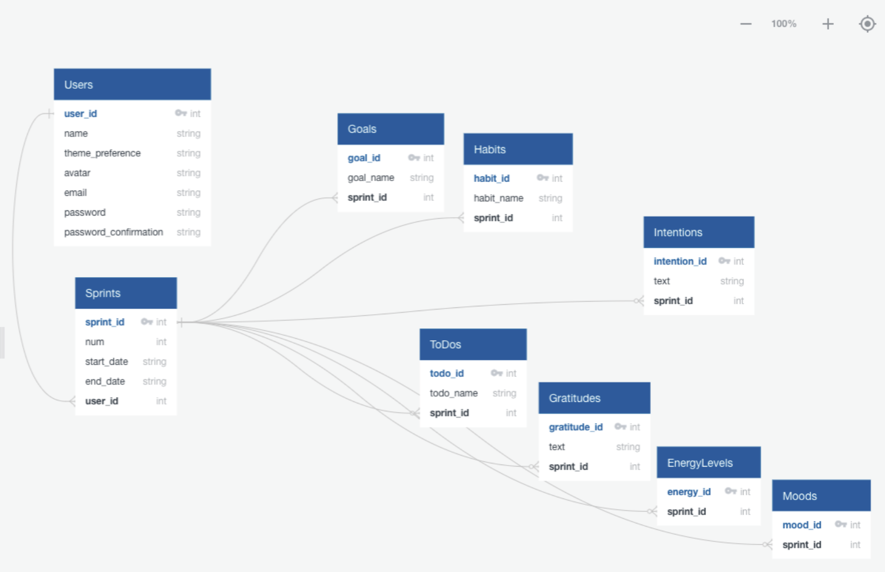
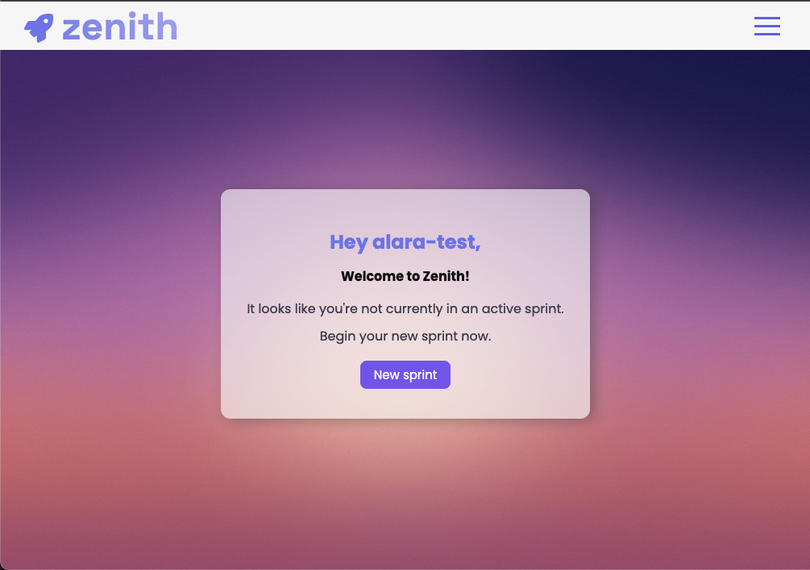
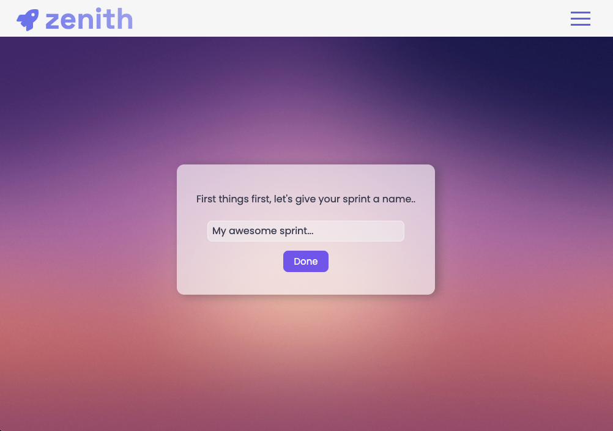
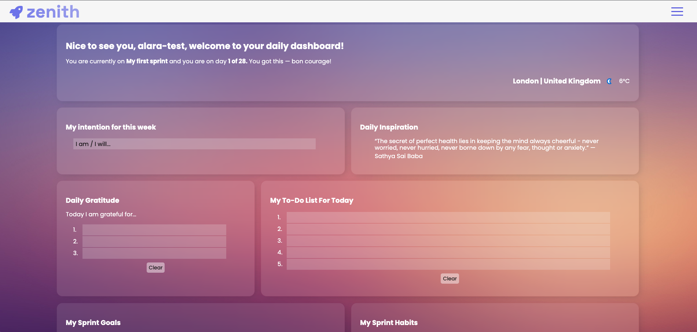
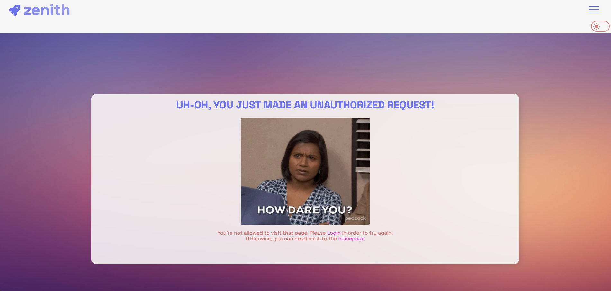
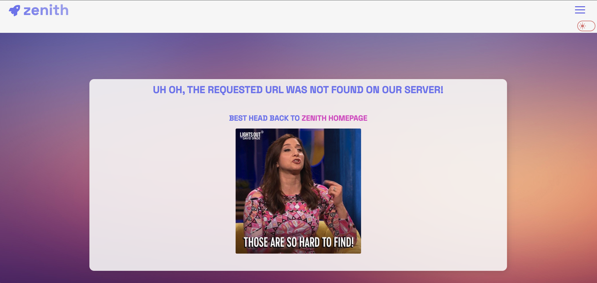

#  Project-4: Zenith

#### General Assembly SEI Project-4 | Zenith | Full-stack app | 10-day sprint | 3-person team

Deployed version of our app can be found here: - https://ga-zenith.netlify.app/

To access all of the features you can register or use the following credentials to login:

email: alara-test@email.com password: pass

## Overview

This was our last project at General Assembly's Software Engineering Immersive Course. As a group, we were tasked with building a full-stack application of our choice.

As a team, we shared an interest in wellbeing and wanted our project to reflect that. We noticed that despite how effective Agile methodology is, there aren't many resources that will help people to incorporate it into their personal development. We wanted to leverage this gap and create an app for developers who are already accustomed to working in sprints.

To access the backend repository please [click here.](https://github.com/alaraayan/sei-project-4-backend)

## Collaborators

- Chloe Brown - [@chloebuilds](https://github.com/chloebuilds)
- Elsa Guibert- [@Elsa245](https://github.com/Elsa245)

## Brief

The brief given was to:

- **Build a full-stack application** by making your own backend and your own front-end
- **Use a Python Django API** using Django REST Framework to serve your data from a Postgres database
- **Consume your API with a separate front-end** built with React
- **Be a complete product** which most likely means multiple relationships and CRUD functionality for at least a couple of models
- **Implement thoughtful user stories/wireframes** that are significant enough to help you know which features are core MVP and which you can cut
- **Have a visually impressive design** to kick your portfolio up a notch and have something to wow future clients & employers. **ALLOW** time for this.
- **Be deployed online** so it's publicly accessible.

## Techonologies Used

**Frontend**

- HTML5
- CSS3, Sass and Styled Components
- React.js
- JavaScript(ES6)
- Dependencies installed: styled-components, react-router-dom, react-toastify, react-loader-spinner, hamburger-react
- [GIPHY API](https://developers.giphy.com/)
- [Open Weather API](https://openweathermap.org/api)

**Backend**

- Python
- Django
- Django REST Framework

**Backend**

- PostgreSQL

**Dev Tools**

- Git
- GitHub
- Google Chrome dev tools
- VScode
- ESlint

## Process

### Preparation & Organisation

### Backend

### Frontend

## Screenshots

## Challenges

## Wins

## Key Learnings

The scope of this project felt overwhelming to us all at times and we had to work well together as a unit to overcome this. We kept a very organised Trello board. We also categorised the project and all of us worked on one leg of the current category, so we faced the problems together instead of each person being responsible for an entire functionality. This was a new approach and I believed worked very well for this project.

The biggest challenge we faced as a team on this project was to incorporate time into the app. Our exposure to time has been very limited at the time and we wanted certain aspects of the dashboard to refresh daily, weekly or stay the same for 28 days. We ended up using React Context which gave us the ability to also have extra validation and prevent logged-in users from accessing other users' dashboards by manipulating the URL.

The main takeaway for me was that I got to develop the muscle of switching between programming languages. All our previous projects were built using JavaScript and for this project, we had to go back and forth between JavaScript and Python. This felt challenging at first, but felt more and more natural with time and ended up being helpful to differentiate logic.

We worked incredibly well together as a team and complimented each other's strengths and in the end, have a project we are proud of.

## Future Features

If we had more time on this project we would add:

- Responsiveness
- Dark mode functionality
- Drag and drop functionality for the dashboard components
- Ability to mark tasks as 'done' manually
- View past sprints
- See and filter tasks in the calendar component
