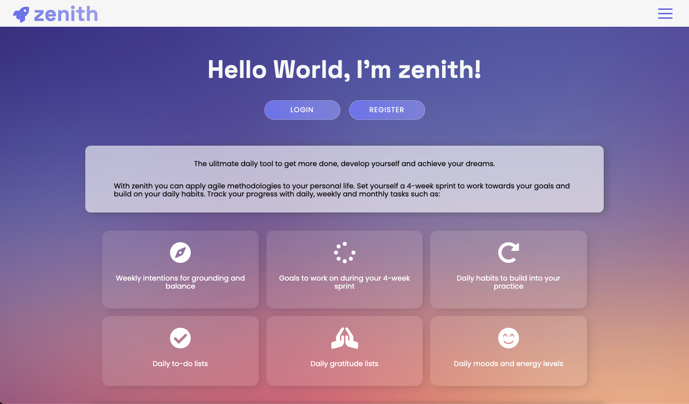

#  Project-4: Zenith

#### General Assembly SEI Project-4 | Zenith | Full-stack app | 10-day sprint | 3-person team

Deployed version of our app can be found here: - https://ga-zenith.netlify.app/

To access all of the features you can register or use the following credentials to login:

email: alara-test@email.com password: pass

<p>

</p>

## Overview

This was our last project at General Assembly's Software Engineering Immersive Course. As a group, we were tasked with building a full-stack application of our choice.

As a team, we shared an interest in wellbeing and wanted our project to reflect that. We noticed that despite how effective Agile methodology is, there aren't many resources that will help people to incorporate it into their personal development. We wanted to leverage this gap and create an app for developers who are already accustomed to working in sprints.

To access the backend repository please [click here.](https://github.com/alaraayan/sei-project-4-backend)

## Collaborators

- Chloe Brown - [@chloebuilds](https://github.com/chloebuilds)
- Elsa Guibert- [@Elsa245](https://github.com/Elsa245)

## Brief

The brief given was to:

- **Build a full-stack application** by making your own backend and your own frontend.
- **Use a Python Django API** using Django REST Framework to serve your data from a Postgres database.
- **Consume your API with a separate front-end** built with React.
- **Be a complete product** which most likely means multiple relationships and CRUD functionality for at least a couple of models.
- **Implement thoughtful user stories/wireframes** that are significant enough to help you know which features are core MVP and which you can cut.
- **Be deployed online** so it's publicly accessible.

## Technologies Used

**Frontend**

- HTML5
- CSS3, Sass and Styled Components
- React.js
- JavaScript(ES6)
- Dependencies installed: styled-components, react-router-dom, react-toastify, react-loader-spinner, hamburger-react
- [GIPHY API](https://developers.giphy.com/)
- [Open Weather API](https://openweathermap.org/api)

**Backend**

- Python
- Django
- Django REST Framework

**Backend**

- PostgreSQL

**Dev Tools**

- Git
- GitHub
- Google Chrome dev tools
- VScode
- ESlint

## Process

### Preparation & Organisation

Our whole project revolved around the dashboard so we started by determining how we wanted it to look and feel. After the wireframing stage we worked on our ERD. At first it seemed very complex, all the daily, weekly and monthly tasks etc. but once we realised everything was actually tied to the user and the current sprint it all clicked.

Final stage of our preparation was setting up our Trello board. We were all already familiar with working with Trello and it helped keep all our tasks organised. We set it up so we would have a few stages for every task to generate a better flow.

We had daily standups within our group and worked together throughout the day. We merged our Git branches every evening, tested the app and assigned new tasks for the next day. Although we worked on our separate tasks, because the functionalities were very similar we were often collaborating, especially while doing the backend.

###### Our Trello board:


###### Our wireframe showing the dashboard and all its components:


###### Our ERD showing how everything is connected to the sprint which is connected to the user:


### Backend

After the planning stage was done our Trello board was populated with backend tasks. Same as project-3 we wanted to finish the backend completely before moving on to the frontend. Being new to Python and Django we decided to divide functionalities up evenly so we were all dealing with them A to Z instead of one person doing all the models and the other doing all the views. Chloe focused mainly on the user and Elsa and I handled the sprint related tasks. I took on the challenge to build the backend for sprint habits, daily to-do list and the editing/deleting functionalities.

The model for a to-do item looked like this:

```python
class DailyToDo(models.Model):
    to_do_item = models.CharField(max_length=50, blank = True, null = True, unique = False)
    is_done = models.BooleanField(default=False)
    start_date = models.DateField(auto_now_add=True)
    end_date = models.DateField()
    sprint = models.ForeignKey(
        Sprint,
        related_name='to_dos',
        on_delete=models.CASCADE,
        null=True
    )
    def __str__(self):
        return f'To-Do: {self.to_do_item}'
```

Because everything was individually connected to the sprint creating the relationships within serializers -what we were most dreading before figuring things out with our ERD- was fairly simple. Here's our `PopulatedSprintSerializer`:

```python
class PopulatedSprintSerializer(SprintSerializer):
    owner = UserSerializer()
    sprint_goals = SprintGoalSerializer(many=True)
    sprint_habits = SprintHabitSerializer(many=True)
    weekly_intentions = WeeklyIntentionSerializer(many=True)
    moods = DailyMoodSerializer(many=True)
    energy_levels = DailyEnergySerializer(many=True)
    to_dos = DailyToDoSerializer(many=True)
    daily_gratitudes = DailyGratitudeSerializer(many=True)
```

Getting our views done proved to be more difficult. We wanted each item to have an end date calculated automatically depending on whether it was a daily item or a sprint habit -which is supposed to end with the sprint-. To achieve this we used `timedelta`. We would then run a check to reset if an item's end date has been reached in the frontend.

```python
request.data["end_date"] = date.today() + timedelta(days=6)
```

### Frontend

Once we were certain our backend was working fully, we started working on the frontend. Being comfortable with React by this point, we knew what we wanted to do and all of us were really excited to bring all of the components together in the dashboard. We needed to make sure that only logged in users would be able to access certain URLs and a user won't be able to see another user's dashboard even if they accidentally put in the correct URL. We decided to keep things light throughout Zenith and I created custom 401 and 404 pages the user would be sent to if they made an incorrect request.

In the frontend I took on the opportunity to build the `newSprint` component. With the user's experience in mind, I wanted the user to create a sprint step by step in order to not feel overwhelmed. A logged in user would be directed to the new sprint page if they were not in an active sprint -`currentSprint ? history.push('/dashboard') : history.push('/sprints/new')`-. Only once the sprint is created a user is able to access their dashboard, which is reset every time the user is logged in, checking and removing expired data accordingly. Since everything is derived from the user, to achieve this functionality we created a `UserContext`. With the `UserContext` we were able to get only relevant data and therefore update the dashboard as needed automatically every time a user logged in.

We also used Styled Components for this project. None of us had used it before and was very intrigued. It took a minute to get used to but once we got the hang of it I'd say we all enjoyed working with it.

## Screenshots

###### Logged in user is guided through to create a sprint:


###### Only users with active sprints are able to access their dashboard:


###### Error handling:


## Challenges

I believe we underestimated how complex Zenith is in the beginning and how much learning we were going to have to do in order to bring it to life. Dealing with time was new to all of us and we had to do a lot of research to implement it the way we wanted to. Also we've never used React Context and Styled Components before and learning them was an exciting challenge. Although it felt overwhelming at times I am so glad we chose to not compromise certain key aspects of Zenith and through our resilience produced the project we set out to.

## Wins

I am really proud of how we took the user's journey into consideration throughout Zenith but especially while creating a new sprint. Using the ternary operator I was able to conditionally show parts of a component to the user, giving the illusion of moving from one page to the next while actually staying in the same one. This made things easy to send to the backend while also providing a good user experience.

```javascript
<div className={isStartingNewSprint ? 'no-show' : ''}>
  <h2>Hey {user.name},</h2>
  <h4>Welcome to Zenith!</h4>

  <p>
    It looks like you&apos;re not currently in an active sprint.{' '}
  </p>
  <p>Begin your new sprint now. </p>
  <button onClick={handleStartToggle}>New sprint</button>
 </div>
<div className={isStartingNewSprint ? '' : 'no-show'}>
  <form onSubmit={handleNewSprint}>
    <p>
      First things first, let&apos;s give your sprint a name..
    </p>

  <Input
    placeholder="My awesome sprint..."
    onChange={handleChange}
    name="sprintName"
    value={formData.sprintName}
    />
  {formErrors.sprintName && <p>{formErrors.sprintName}</p>}

  <button>Done</button>
  </form>
</div>
```

## Key Learnings

<p>The scope of this project felt overwhelming to us all at times and we had to work well together as a unit to overcome this. We kept a very organised Trello board. We also categorised the project and all of us worked on one leg of the current category, so we faced the problems together instead of each person being responsible for an entire functionality. This was a new approach and I believed worked very well for this project.

The biggest challenge we faced as a team on this project was to incorporate time into the app. We wanted certain aspects of the dashboard to refresh daily, weekly or stay the same for 28 days. We ended up using React Context which gave us the ability to also have extra validation and prevent logged-in users from accessing other users' dashboards by manipulating the URL.

The main takeaway for me was that I got to develop the muscle of switching between programming languages. All our previous projects were built using JavaScript and for this project, we had to go back and forth between JavaScript and Python. This felt challenging at first, but felt more and more natural with time and ended up being helpful to differentiate logic.

We worked incredibly well together as a team and complemented each other's strengths and in the end, have a project we are proud of.</p>

## Future Features

If we had more time on this project we would add:

- Responsiveness.
- Dark mode / light mode.
- Drag and drop functionality for the dashboard components.
- Ability to mark tasks as 'done' manually.
- View past sprints.
- See and filter tasks in the calendar component.
